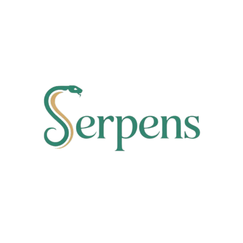

# 🐍 Serpens

> **Serpens** — una calculadora financiera moderna con interfaz gráfica (GUI) intuitiva para calcular **Valor Actual Neto (VAN)**, **Margen de Contribución** y **Punto de Equilibrio**.  
> Diseñada con Python y una interfaz visual moderna, ideal para profesionales financieros, emprendedores y estudiantes de economía.  



---

## ✨ Características principales

✅ **Interfaz moderna e interactiva** – fácil de usar para cualquier persona, sin necesidad de conocimientos técnicos.  
✅ **Cálculos financieros clave**:
- **VAN (Valor Actual Neto)**: evalúa la rentabilidad de una inversión.  
- **Margen de Contribución**: mide la rentabilidad de un producto o servicio.  
- **Punto de Equilibrio**: determina el nivel de ventas necesario para cubrir los costos.  
✅ **Diseño UI/UX profesional**, con colores, distribución y tipografía pensadas para la claridad visual.  
✅ **Empaquetado con PyInstaller** – se genera un ejecutable `.exe` listo para distribución en Windows.  

---

## 🧩 Requisitos previos

Asegúrate de tener instalado:

- [Python 3.10+](https://www.python.org/downloads/)
- pip (viene incluido con Python)
- Las dependencias listadas en `requirements.txt`

Instalación rápida de dependencias:

```bash
pip install -r requirements.txt
